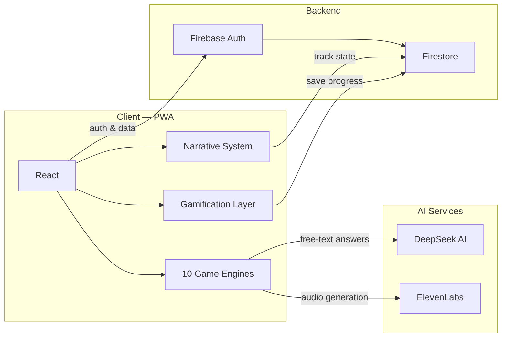

# 🎮 Tranquilo.Quest

**AI-powered gamified platform for learning survival Spanish**

Built for Russian-speaking expats in Spain who need practical language skills for everyday situations — not academic grammar drills.

🔗 [Live Demo](https://tranquilo.quest) · 📂 [Portfolio](https://xenia19.github.io/portfolio)

---

## ✨ What makes it different

Most language apps teach you to conjugate verbs. Tranquilo.Quest drops you into a story: you just moved to Barcelona, your neighbor Carmen is complaining about noise, and you need to explain yourself in Spanish — right now.

- **10 custom game engines** — not just flashcards
- **AI Tutor** (DeepSeek) — analyzes your free-text answers, gives feedback in your native language
- **Narrative-driven** — recurring NPCs, storyline progression, real-world context
- **Gamification** — XP, coins, achievements, level unlocks

---

## 🎯 Game engines

| Engine | What it does |
|--------|-------------|
| 🎭 **Roleplay** | Free-text dialog simulator with AI feedback |
| 🎧 **Reels** | Audio comprehension — rebuild phrases from native speaker clips |
| ⚡ **Chaos** | Timed 3-option reaction drills |
| ⚔️ **Battle** | Progressive quiz sequences with increasing difficulty |
| 📖 **Stories** | Visual vocabulary cards with audio and mini-quizzes |
| 🔀 **Sorter** | Swipe-based card categorization |
| 📄 **PuzzleDoc** | Analyze real documents (tickets, forms, signs) |
| 📞 **Call** | Boss-level phone call simulation |
| 📸 **IRL Quest** | Real-world tasks (photo verification) |
| 🎬 **Scene** | Narrative bridges between lessons with NPCs |

---

## 🏗️ Architecture



### How data flows

1. **User interacts** with a game engine (e.g. types a response in Roleplay)
2. **Engine sends** the free-text input to DeepSeek AI for analysis
3. **AI returns** corrections, hints, and explanations in Russian
4. **Progress saved** to Firestore — XP earned, achievements unlocked
5. **Narrative advances** — new NPCs appear, story continues

---

## 🛠 Tech stack

| Layer | Technologies |
|-------|-------------|
| **Frontend** | React, JavaScript (ES6+), CSS, HTML |
| **Backend** | Firebase Auth, Firestore, real-time sync |
| **AI** | DeepSeek AI (text analysis + feedback), ElevenLabs (voice synthesis) |
| **Infrastructure** | PWA, Service Workers (offline support), responsive design |
| **Methodology** | TBLT (Task-Based Language Teaching) |

---

## 🧩 Project structure

```
tranquilo-quest/
├── src/
│   ├── engines/           # 10 game engine components
│   │   ├── Roleplay/      # AI-powered dialog simulator
│   │   ├── Reels/         # Audio comprehension
│   │   ├── Chaos/         # Timed reaction drills
│   │   ├── Battle/        # Progressive quizzes
│   │   ├── Stories/       # Visual vocab cards
│   │   ├── Sorter/        # Swipe categorization
│   │   ├── PuzzleDoc/     # Document analysis
│   │   ├── Call/          # Phone simulation (boss level)
│   │   ├── IRLQuest/      # Real-world photo tasks
│   │   └── Scene/         # Narrative bridges
│   ├── services/
│   │   ├── deepseek.js    # AI tutor integration
│   │   ├── elevenlabs.js  # Voice synthesis
│   │   └── firebase.js    # Auth + Firestore
│   ├── gamification/      # XP, coins, achievements
│   ├── narrative/         # NPC system, story progression
│   └── App.jsx
├── public/
└── package.json
```

---

## 🎭 NPCs (Narrative universe)

The app has a persistent storyline. The student just arrived in Barcelona and meets:

- **Paco** ☕ — bartender at the café across the street. Friendly, talks fast
- **Antonio** 👨‍💻 — neighbor, a programmer. Helps with tips via WhatsApp
- **Carmen** 👵 — upstairs neighbor. A bit grumpy, but kind

NPCs appear across lessons, creating continuity and emotional connection to the learning process.

---

## 📸 Screenshots

<!-- Add your screenshots here -->
[Home screen](screenshots/dashboard.png) 
[Roleplay engine](screenshots/reels_github.png)
[Chaos engine](screenshots/chat_github.png)

Built with ❤️ by [Ksenia Galaktionova](https://xenia19.github.io/portfolio)
